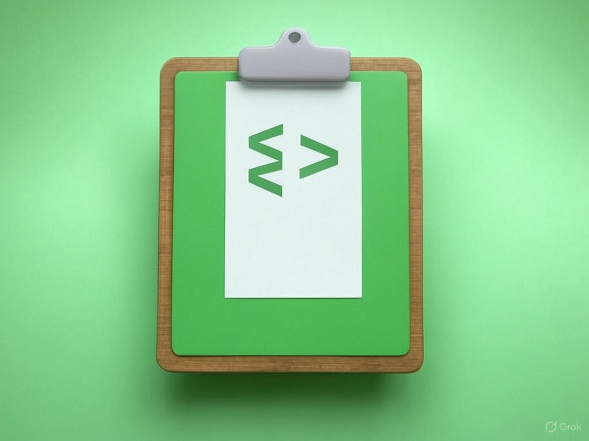

# GeeksforGeeks Paste Enabler

  

A browser extension that enables paste functionality on GeeksforGeeks coding platforms, including JobAthon and other contest pages where copy-paste is normally restricted.

## Features

- Enables paste functionality on restrictive coding platforms
- Works on GeeksforGeeks Job-A-Thon and all contest pages
- Multiple paste methods for different scenarios
- Keyboard shortcuts for quick pasting
- Special handling for contest navigation
- No configuration needed

## Installation

### Method 1: Manual Installation (Recommended)

1. Download the [latest release ZIP file](https://github.com/yourusername/GeeksforGeeks-Paste-Enabler/releases)
2. Extract the ZIP file to a folder
3. Open Chrome or Edge and go to `chrome://extensions/` or `edge://extensions/`
4. Enable "Developer mode" (toggle in the top-right corner)
5. Click "Load unpacked" button
6. Select the extracted folder

### Method 2: Direct Loading (For Developers)

1. Clone this repository
2. Open Chrome or Edge and go to `chrome://extensions/`
3. Enable "Developer mode"
4. Click "Load unpacked" button
5. Select the repository folder

## How It Works

This extension works by:

1. Removing any paste event listeners that block the paste function
2. Adding its own paste handlers with higher priority
3. Removing any CSS or overlay elements that might block pasting
4. Enabling multiple methods to paste code into editors
5. Adding convenient buttons for paste operations

## Usage Guide

When you're on a GeeksforGeeks contest or JobAthon page:

1. **Regular Paste (Try First)**
   - Try using `Ctrl+V` normally in the editor
   - If it works, great! If not, try the other methods below

2. **Blue "Paste Code" Button**
   - After copying your code, click the blue "Paste Code" button in the top-right corner
   - This button is specifically designed for ACE editors used in contests

3. **Special Buttons for JobAthon Pages**
   - Purple "JobAthon Paste" button specifically for hiring challenges
   - Red "Emergency Paste" button for difficult cases

4. **Keyboard Shortcuts**
   - `Alt+V` - Alternative paste method for contest pages
   - `Alt+D` - Opens emergency paste dialog

For more detailed instructions, see the [USAGE.md](USAGE.md) file.

## Troubleshooting

If pasting still doesn't work:

- Make sure the extension is enabled
- Try using the blue "Paste Code" button instead of Ctrl+V
- Use Alt+V keyboard shortcut on contest pages
- Click the red "Emergency Paste" button for difficult cases
- Refresh the page and try again

## Disclaimer

This extension is for educational purposes and to improve productivity. Use it responsibly and in accordance with the terms of service of the websites you visit.

## License

This project is licensed under the MIT License.
